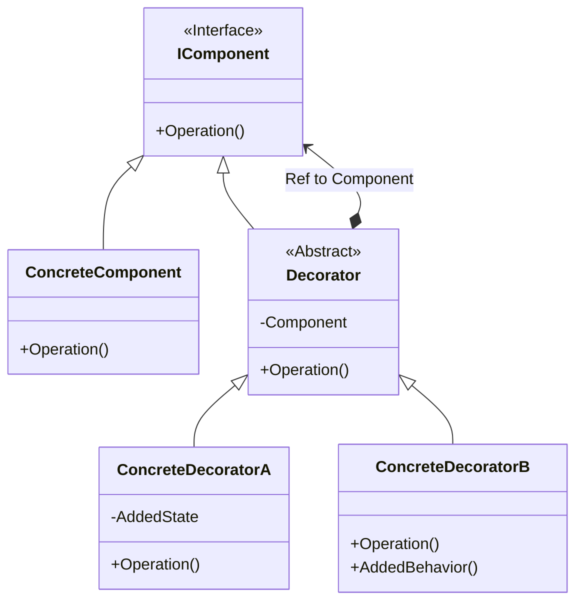

# An Example of Decorator Design Pattern with C#

## What is Decorator?
>The Decorator design pattern attaches additional responsibilities to an object dynamically. This pattern provide a flexible alternative to subclassing for extending functionality.

* Component: 
  - Defines the interface for objects that can have responsibilities added to them dynamically
  - Usually an abstract class or interface
* ConcreteComponent: 
  - Defines an object to which additional responsibilities can be attached
  - Inherits or implements the Component class/interface
* Decorator: 
  - Maintains a reference to a Component object
  - Usually an abstract class
  - Inherits or implements the Component class/interface
* ConcreteDecorator: 
  - Adds responsibilities to the component
  - Inherits the Decorator

---
## Example One

---
## Example Two
You have an e-commerce website that sells various products. Each product has a price and some 
basic information, such as the name and description. However, there are various discounts and 
promotions that can be applied to the products, such as a percentage discount, a buy-one-get-one-free offer, 
or a free gift with purchase.

In this scenario, the products are the Component objects, and the discounts and promotions are 
the Decorator objects. You can create a base Product class that implements the basic information 
and price of the product. Then, you can create various Decorator classes that add different types 
of discounts and promotions to the product.

For example, you can create a `PercentageDiscountDecorator` class that adds a percentage discount 
to the product's price. You can also create a `FreeGiftDecorator` class that adds a free gift to 
the product with a certain purchase amount. Finally, you can create a `BuyOneGetOneFreeDecorator` 
class that adds a buy-one-get-one-free offer to the product.

By using the Decorator pattern in this scenario, you can add discounts and promotions to the 
products dynamically, without changing the underlying Product class or its interface. This allows 
you to easily add or remove different types of discounts and promotions without affecting the 
existing code.

---

In summary, the Decorator pattern is useful in scenarios where you have a base object or component 
that needs to be extended with additional functionality dynamically, without changing the underlying 
object or its interface. This makes it a useful pattern in situations where you need to add or 
remove functionality from an object at runtime, while keeping the rest of the code unchanged.

