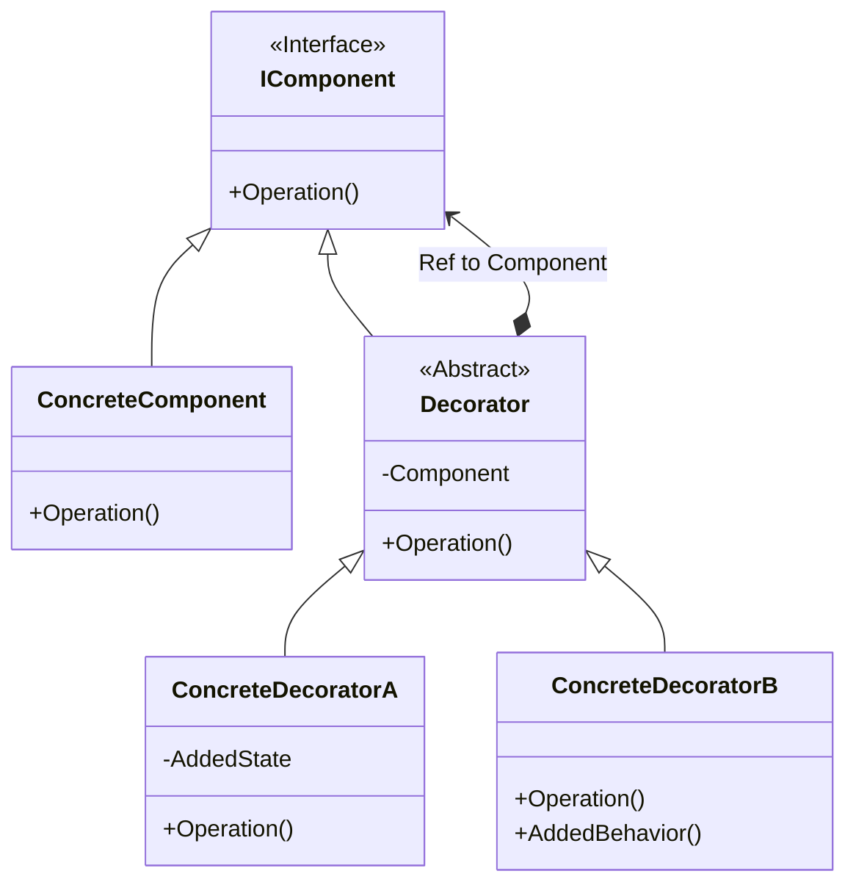

# An Example of Decorator Design Pattern with C#

## What is Decorator?
>The Decorator design pattern attaches additional responsibilities to an object dynamically. This pattern provide a flexible alternative to subclassing for extending functionality.

* Component: 
  - Defines the interface for objects that can have responsibilities added to them dynamically
  - Usually an abstract class or interface
* ConcreteComponent: 
  - Defines an object to which additional responsibilities can be attached
  - Inherits or implements the Component class/interface
* Decorator: 
  - Maintains a reference to a Component object
  - Usually an abstract class
  - Inherits or implements the Component class/interface
* ConcreteDecorator: 
  - Adds responsibilities to the component
  - Inherits the Decorator